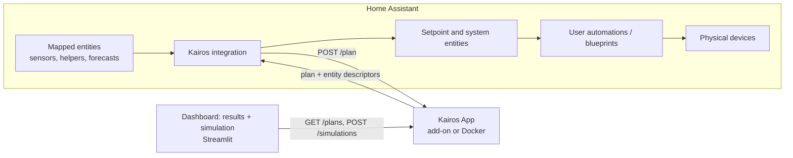

# Home Assistant Integration for Kairos
###  Add-on / Docker App and a thin custom integration

> **Status:** draft. This document builds on `backend_architecture.md` (sign convention, asset classes, conversion layer, optimizer). It describes how Kairos connects to Home Assistant (HA); it does not repeat the optimizer design.

# Contents

- [System Overview](#system-overview)
  - [Goals and Non-Goals](#goals-and-non-goals)
  - [Components](#components)
  - [Design Principles](#design-principles)
  - [Control Cycle](#control-cycle)
- [App API](#app-api)
  - [General](#general)
  - [Endpoints](#endpoints)
  - [GET /schema](#get-schema)
  - [POST /plan: Request](#post-plan-request)
  - [POST /plan: Response](#post-plan-response)
  - [Errors](#errors)
  - [POST /history](#post-history)
  - [Plan Records and Read Endpoints](#plan-records-and-read-endpoints)
  - [Simulation Endpoints](#simulation-endpoints)
- [App Processing Pipeline](#app-processing-pipeline)
- [Integration: Configuration](#integration-configuration)
  - [Discovery and Connection](#discovery-and-connection)
  - [Config Flow](#config-flow)
  - [Asset Schema Reference](#asset-schema-reference)
  - [Stored Configuration](#stored-configuration)
- [Integration: Runtime](#integration-runtime)
- [Exposed Entities](#exposed-entities)
  - [Conventions](#conventions)
  - [Setpoint Definition](#setpoint-definition)
  - [Entities per Asset Type](#entities-per-asset-type)
  - [System Entities](#system-entities)
- [Staleness and Failure Signalling](#staleness-and-failure-signalling)
- [Results Dashboard](#results-dashboard)
  - [Purpose and Scope](#purpose-and-scope)
  - [Architecture](#architecture)
  - [Data Needs](#data-needs)
  - [Access](#access)
- [Simulation](#simulation)
  - [Use Cases](#use-cases)
  - [Scenario](#scenario)
  - [Execution and Isolation](#execution-and-isolation)
  - [Simulation Interface](#simulation-interface)
  - [Scope](#scope)
- [Packaging and Deployment](#packaging-and-deployment)
- [Phased Rollout and Testing](#phased-rollout-and-testing)
- [Open Questions](#open-questions)


# System Overview

## Goals and Non-Goals

**Goals**

- Let a user select the HA entities that represent their energy system and describe their devices, with as little effort as possible.
- Compute an optimized plan (power setpoints per controllable asset over the planning horizon) with the Kairos optimizer.
- Expose that plan as HA entities.
- Provide a dashboard in the App that shows the latest optimization results and their history.
- Let users and developers run the optimizer on simulated (non-real) data, without Home Assistant or the integration.

**Non-goals**

- Kairos does **not** send commands to physical devices. How a setpoint is applied (inverter mode, charger current, heat pump offset, appliance start) is the responsibility of the user, through their own automations or blueprints.
- The integration does not ship dashboards or cards. Entity selection relies on HA's native selectors, and result visualization is the job of the App's [Results Dashboard](#results-dashboard). The `plan` attribute on entities remains available for users who want to build their own HA cards.
- Kairos does not depend on any cloud service.

## Components

Kairos consists of two parts. The **App** (GitHub repository `kairos`) is the Kairos application that holds all logic. It is delivered as a Home Assistant add-on or as a standalone Docker container. The **integration** (GitHub repository `kairos-ha-integration`) is the HA custom component that connects Home Assistant to the App.

| | **App** (add-on or standalone Docker) | **Integration** (custom component, HACS) |
|---|---|---|
| Role | Core functionality and logic | Thin bridge between HA and the App |
| Contains | Normalization, forecast parsing, conversion layer, MILP optimizer, setpoint generation, results dashboard, simulation data user interface | Entity configuration, API call, output entity exposure |
| Knows about HA | Nothing (only entity IDs as opaque labels) | Everything HA-specific |
| Knows about devices | All asset types and their parameters | Nothing, only "entity in, entity out" |

The App image also contains a Streamlit **dashboard** with two parts: the **results dashboard**, which shows the latest optimization results and their history, and the **simulation interface**, where scenario data can be entered to run the optimizer on non-real data. This lets users try Kairos and lets developers test the optimizer without Home Assistant or the integration. The dashboard runs as a second process next to the API and talks to it only through the API (see [Results Dashboard](#results-dashboard) and [Simulation](#simulation)).



## Design Principles

1. **The App owns all logic.** Adding or changing a device type must not require an integration release.
2. **The integration is generic.** It renders forms from an App-provided schema, relays raw entity values, and creates entities from App-provided descriptors without interpreting them.
3. **One image, two ways to run.** The add-on and the standalone Docker container are the same image behind the same API.
4. **The user owns the last mile.** Setpoints are published, not applied.
5. **Fail visibly.** When there is no valid plan, setpoint entities become `unavailable` so user automations can fall back to safe behavior.
6. **The dashboard is an API client.** It reads results and submits simulation scenarios through the App's public API and never touches the database directly, so it stays decoupled and replaceable.
7. **Simulation never touches the real system.** Simulation runs use the same processing pipeline as real cycles, so results are comparable, but they are stored separately and never create entities or influence the demand baseline.

## Control Cycle

Each cycle (default every 15 minutes, aligned to the time step, plus event triggers):

1. The integration reads all mapped entities and forecast attributes.
2. It sends them **unmodified** (plus per-entity hints such as unit and sign inversion) to `POST /plan`.
3. The App normalizes the data, runs the conversion layer, solves the MILP, stores the full plan record (for the dashboard), and returns the plan as a list of entity descriptors.
4. The integration creates or updates the corresponding entities. Each setpoint entity shows the value for the *current* time step and advances automatically at step boundaries (see [Plan Replay](#plan-replay)).
5. The user's automations react to the setpoint entities and control the devices.
6. The next cycle observes the resulting state (SoC, temperatures). This closes the receding-horizon loop; Kairos never needs confirmation that a setpoint was applied.


# App API

## General

| Aspect | Definition |
|---|---|
| Format | JSON over HTTP |
| Auth | `Authorization: Bearer <token>` on all endpoints except `/health` |
| Versioning | Integer `api_version` in every request and response. `/health` reports the supported range so the integration can check compatibility at setup. |
| Time | ISO 8601 with offset in payloads. The App works in UTC internally. |
| Units in responses | SI-style, consistent with the backend architecture: W, Wh, fractions (0-1) for SoC, price per Wh |

## Endpoints

| Method | Path | Purpose |
|---|---|---|
| `GET` | `/health` | Liveness, App version, supported `api_version` range |
| `GET` | `/schema` | Asset types with their roles and parameters (drives the config flow) |
| `POST` | `/plan` | Run one planning cycle. Returns the plan and entity descriptors |
| `POST` | `/history` | Backfill historical samples (household demand baseline) |
| `GET` | `/plans/latest` | Full plan record of the most recent cycle (used by the dashboard, also useful for debugging) |
| `GET` | `/plans` | Plan summaries in a time range (`from`, `to`, `limit`) |
| `GET` | `/plans/{plan_id}` | Full plan record of one cycle |
| `GET` | `/samples` | Recorded input samples per asset and role (`asset_id`, `role`, `from`, `to`), for planned-versus-actual views |
| `POST` | `/simulations` | Run a scenario on non-real data. Returns a plan record flagged `source: "simulation"` |
| `GET` | `/simulations` | List stored simulation runs |
| `GET` | `/simulations/{id}` | One simulation run (plan record and scenario) |
| `DELETE` | `/simulations/{id}` | Delete a stored simulation run |
| `GET` | `/scenarios/examples` | Example scenarios bundled with the App |

## GET /schema

Describes what the user can configure. The integration turns each field into a HA selector (see [Config Flow](#config-flow)).

```json
{
  "api_version": 1,
  "asset_types": [
    {
      "type": "battery",
      "asset_class": "storage",
      "title": "Home battery",
      "multiple": true,
      "inputs": [
        {"role": "soc", "title": "State of charge", "kind": "sensor",
         "unit": "%", "required": true}
      ],
      "parameters": [
        {"key": "capacity", "title": "Energy capacity", "type": "number",
         "unit": "Wh", "required": true, "bindable": false},
        {"key": "min_soc", "title": "Minimum SoC", "type": "number",
         "unit": "%", "default": 10, "min": 0, "max": 100},
        {"key": "max_charge_power", "title": "Max charge power", "type": "number",
         "unit": "W", "required": true}
      ]
    }
  ]
}
```

Field semantics:

- `kind`: `sensor`, `binary_sensor`, `forecast` (entity plus optional attribute and format), or `entity` (any).
- `bindable`: the parameter may be a fixed value **or** bound to an HA entity (for example an `input_number` or `input_datetime` helper), so users can change it without reconfiguring.
- `trigger`: on inputs, marks entities whose changes should trigger an early re-plan (for example EV plugged in).

## POST /plan: Request

The request carries raw values. Normalization is the App's job.

```json
{
  "api_version": 1,
  "request_id": "b1f0c2e0",
  "now": "2026-09-30T14:05:00+02:00",
  "timezone": "Europe/Amsterdam",
  "settings": {
    "step_minutes": 15,
    "horizon_hours": 24,
    "currency": "EUR",
    "max_plan_age_minutes": 60,
    "solver_time_limit_s": 30
  },
  "assets": [
    {
      "id": "grid",
      "type": "grid",
      "name": "Grid",
      "inputs": {
        "power": {
          "entity_id": "sensor.p1_power", "state": "1234", "unit": "W",
          "invert_sign": true, "last_updated": "2026-09-30T14:04:52+02:00"
        },
        "import_price": {
          "entity_id": "sensor.electricity_price", "state": "0.21",
          "unit": "EUR/kWh", "format": "generic_timeseries",
          "attributes": {"prices": [{"start": "2026-09-30T14:00:00+02:00", "value": 0.21}]}
        }
      },
      "parameters": {
        "max_import_power": {"value": 17000, "unit": "W"},
        "max_export_power": {"value": 17000, "unit": "W"}
      }
    },
    {
      "id": "home_battery",
      "type": "battery",
      "name": "Home Battery",
      "inputs": {
        "soc": {"entity_id": "sensor.battery_soc", "state": "50", "unit": "%",
                "last_updated": "2026-09-30T14:04:40+02:00"}
      },
      "parameters": {
        "capacity": {"value": 10, "unit": "kWh"},
        "min_soc": {"value": 10, "unit": "%"}
      }
    }
  ]
}
```

Rules:

- `state` is always the raw string state from HA (including `unavailable` / `unknown`).
- `attributes` is only sent for `forecast` inputs, and only those attributes that the user selected.
- `unit` is the entity's unit of measurement. For fixed parameter values entered in the config flow it is the unit defined in the schema.
- `invert_sign` is a per-entity hint set by the user; the App applies it.

## POST /plan: Response

```json
{
  "api_version": 1,
  "plan_id": "2f7c9d",
  "generated_at": "2026-09-30T14:05:03+02:00",
  "valid_until": "2026-09-30T15:05:03+02:00",
  "status": "ok",
  "horizon": {"start": "2026-09-30T14:00:00+02:00", "step_minutes": 15, "steps": 96},
  "solver": {"status": "optimal", "duration_ms": 850},
  "summary": {"expected_cost": 1.84, "currency": "EUR"},
  "warnings": [
    {"code": "input_unavailable", "asset_id": "ev", "message": "Sensor sensor.ev_soc is unavailable; asset excluded from plan."}
  ],
  "entities": [
    {
      "key": "home_battery_setpoint",
      "asset_id": "home_battery",
      "platform": "sensor",
      "name": "Setpoint",
      "unit": "W",
      "device_class": "power",
      "state_class": "measurement",
      "series": [
        {"start": "2026-09-30T14:00:00+02:00", "value": 2500.0},
        {"start": "2026-09-30T14:15:00+02:00", "value": -1200.0}
      ],
      "attributes": {
        "planned_soc": [
          {"start": "2026-09-30T14:00:00+02:00", "value": 0.52}
        ]
      }
    }
  ]
}
```

**Entity descriptor fields**

| Field | Meaning |
|---|---|
| `key` | Stable identifier. With the config entry ID it forms the entity's `unique_id` |
| `asset_id` | Groups the entity under an HA device. `null` for system entities |
| `platform` | `sensor` or `binary_sensor` |
| `name`, `unit`, `device_class`, `state_class`, `options` | Passed to the entity as-is (`options` for enum sensors) |
| `series` | Time-varying value as a step function: each entry holds from its `start` until the next entry. The integration derives the entity state from the entry containing "now" and also copies the series to a `plan` attribute |
| `state` | Alternative to `series` for values that are not time-varying |
| `attributes` | Additional opaque attributes (for example planned SoC trajectories) |

`status` is one of `ok`, `degraded` (a plan was produced but some assets were excluded or the solver hit its time limit) or `error` (no usable plan). Solver problems and excluded assets are described in `warnings`.

## Errors

| HTTP | Meaning | Integration behavior |
|---|---|---|
| 200 | Response body carries `status` and `warnings` | Apply the plan (unless `status` is `error`) |
| 401 | Invalid token | Start a HA re-auth flow |
| 409 | `api_version` not supported | Raise a HA Repair issue, stop cycles |
| 422 | Invalid payload; body lists per-field errors | Surface in status entity and logs, keep last valid plan |
| 5xx / timeout | App unavailable or overloaded | Back off and retry; keep replaying the last plan |

Because storage limits are soft constraints (see the backend architecture), an infeasible problem should not occur in normal operation. Solver timeouts return the best incumbent solution with `status: degraded`.

## POST /history

Backfills historical samples so the household demand baseline works from day one.

```json
{
  "api_version": 1,
  "samples": [
    {"asset_id": "household", "role": "power", "t": "2026-09-01T00:00:00+02:00", "value": 480.0, "unit": "W"}
  ]
}
```

The integration builds this from HA long-term and short-term statistics (recorder) when the household asset is first configured. After that, the App records the values it receives with every `/plan` call.

## Plan Records and Read Endpoints

The `/plan` response is deliberately lean: it only carries what the integration needs to create entities. For every cycle the App additionally stores a **plan record** with everything the optimizer used and produced, identified by the same `plan_id`. The read endpoints expose these records, and the [Results Dashboard](#results-dashboard) is their main consumer.

All read endpoints require the bearer token like the rest of the API.

**Draft record structure.** Series are plain arrays aligned to the record's own time grid (`horizon.start` plus `step_minutes`), which keeps records compact. The final structure follows from the visualization document.

```json
{
  "plan_id": "2f7c9d",
  "source": "real",
  "generated_at": "2026-09-30T14:05:03+02:00",
  "valid_until": "2026-09-30T15:05:03+02:00",
  "status": "ok",
  "horizon": {"start": "2026-09-30T14:00:00+02:00", "step_minutes": 15, "steps": 96},
  "solver": {"status": "optimal", "duration_ms": 850},
  "initial_state": {"home_battery": {"soc": 0.5}, "dhw": {"soc": 0.75}},
  "inputs": {
    "import_price": [0.00021, 0.00020],
    "export_price": [0.00008, 0.00008],
    "pv_forecast": [0, 120],
    "household_forecast": [480, 450]
  },
  "assets": {
    "home_battery": {
      "type": "battery",
      "setpoint": [2500, -1200],
      "charge": [2630, 0],
      "discharge": [0, 1263],
      "soc": [0.52, 0.49]
    }
  },
  "grid": {"import": [3100, 0], "export": [0, 350]},
  "cost": {
    "total": 1.84,
    "import_cost": 2.10,
    "export_revenue": 0.31,
    "building_thermal_discharge_benefit": 0.0,
    "remaining_storage_value": 0.0,
    "penalties": 0.05
  },
  "warnings": []
}
```

The `cost` breakdown mirrors the terms of the objective function in the backend architecture (import cost, export revenue, building thermal discharge benefit, remaining storage value, soft-constraint penalties), so the dashboard can explain *why* a plan looks the way it does.

**Retention.** Records are kept for a configurable number of days (proposed default: 30) and then deleted.

**Source.** `source` is `real` for records created by `POST /plan` and `simulation` for records created by a simulation run. The `/plans` endpoints only return real records; simulation records are only reachable through `/simulations`.

## Simulation Endpoints

Simulation runs the optimizer on data supplied by the caller instead of data read from HA. It is described in detail in [Simulation](#simulation); this section defines the API.

- `POST /simulations` takes a **scenario** (see [Scenario](#scenario)), runs it through the same processing pipeline as `POST /plan`, and returns the resulting plan record with `source: "simulation"` and a `simulation_id`. The scenario is stored together with the record.
- `GET /simulations` and `GET /simulations/{id}` list and retrieve stored runs. `DELETE /simulations/{id}` removes a run.
- `GET /scenarios/examples` returns the example scenarios bundled with the App, so that new users have something to run immediately.
- Simulation endpoints use the same bearer token as the rest of the API.

A simulation never produces entity descriptors and is never seen by the integration.


# App Processing Pipeline

For every `POST /plan` and every simulation run the App runs the following stages:

| # | Stage | Description |
|---|---|---|
| 1 | Validate | Check payload against the schema. Reject with 422 on structural errors |
| 2 | Normalize | Convert units and signs to the Kairos convention (below) |
| 3 | Availability check | Handle `unavailable`/`unknown` and stale inputs (see [Input Problems](#input-problems)) |
| 4 | Forecasts | Parse provider formats and resample onto the optimizer time grid |
| 5 | Conversion layer | Map physical parameters to the unified `Storage` / `Load` / `Source` objects (see backend architecture) |
| 6 | Optimize | Build and solve the MILP |
| 7 | Setpoint conversion | Convert decision variables to the exposed setpoints (see [Setpoint Definition](#setpoint-definition)) |
| 8 | Descriptors | Build entity descriptors and summary |
| 9 | Persist | Store input samples and the full plan record in the local SQLite database |

**Simulation runs** use the same stages, so their results are directly comparable to real plans. The differences are at the edges: inputs arrive as plain values and series instead of HA states (see [Scenario](#scenario)), the availability check (stage 3) is skipped because simulated inputs are always present, no entity descriptors are needed (stage 8), and stage 9 stores the record and its scenario in separate simulation storage without recording input samples for the demand baseline.

**Normalization**

| Quantity | Normalized to | Notes |
|---|---|---|
| Power | W | `kW`, `MW` converted |
| Energy | Wh | `kWh`, `MWh` converted |
| Price | currency per Wh | `EUR/kWh`, `ct/kWh` converted |
| SoC | fraction 0-1 | `%` converted |
| Temperature | °C | `°F`, `K` converted |
| Sign | Kairos [sign convention](backend_architecture.md#sign-convention) | Applied when `invert_sign` is set. Grid: import positive |

**Forecast adapters.** A forecast input has a `format` that selects an adapter. A `generic_timeseries` adapter (list of `{start, value}`) is always available. Provider-specific adapters (candidates: Nordpool, ENTSO-E, Tibber, Forecast.Solar, Solcast) are added over time without touching the integration. Series are resampled to the optimizer time step (mean for power, sum for energy, hold for prices). The planning horizon is limited by the shortest required forecast (typically the price forecast).

**Household demand baseline.** The household demand forecast is built from history: a profile per weekday and time of day (median over the last N weeks). Cold start uses the current demand as a flat estimate until enough history exists.

**Persistence.** The App keeps a small SQLite database in its data directory (`/data` in the add-on, a volume in Docker) with input samples (for the demand baseline and planned-versus-actual views) and the plan records described in [Plan Records and Read Endpoints](#plan-records-and-read-endpoints), pruned according to the retention setting. Simulation runs and their scenarios are stored in separate tables and are never used for the demand baseline. Planning itself stays stateless: each `/plan` request contains everything needed to compute a plan, and history only shapes the household demand baseline.


# Integration: Configuration

## Discovery and Connection

| Deployment | Connection |
|---|---|
| HA add-on | Supervisor discovery lets the integration find the add-on and receive its token automatically. Fallback: manual URL using the add-on's internal hostname |
| Standalone Docker | User enters URL and token manually |

At setup the integration calls `GET /health` and checks that its `api_version` is supported. Supervisor discovery for a *custom* integration needs to be validated (see [Open Questions](#open-questions)); manual entry must always work.

## Config Flow

1. **Connect:** discovery or manual URL and token, then a health and compatibility check.
2. **Global settings:** time step, horizon, update interval, currency, `max_plan_age_minutes`.
3. **Add assets:** a menu lists the asset types from `/schema`. Each asset gets a generated form; assets are stored as *config subentries* if the minimum supported HA version allows it, otherwise as items within the entry data.
4. **Review:** summary of all mapped entities and parameters.

The options flow allows adding, editing and removing assets at any time.

**Schema to selector mapping**

| Schema field | HA selector |
|---|---|
| `kind: sensor` | `EntitySelector` (domain `sensor`, filtered on `device_class` if given) |
| `kind: binary_sensor` | `EntitySelector` (domain `binary_sensor`) |
| `kind: forecast` | `EntitySelector` + optional attribute name + `format` dropdown |
| `type: number` | `NumberSelector` with the unit from the schema |
| `type: boolean` | `BooleanSelector` |
| `type: time` / `datetime` | `TimeSelector` / `DateTimeSelector` |
| `type: enum` | `SelectSelector` |
| `bindable: true` | Extra switch: "fixed value" or "use entity" (`input_number`, `input_datetime`, `sensor`) |
| every sensor input | Optional "invert sign" switch |

## Asset Schema Reference

Initial asset types, aligned with the conversion layers in the backend architecture. `Trg` marks inputs that trigger an early re-plan.

**Grid** (`grid`)

| Key | Kind | Unit | Req. | Notes |
|---|---|---|---|---|
| `power` | input sensor | W | yes | Net grid power |
| `import_price` | input forecast | price/kWh | yes | Trg |
| `export_price` | input forecast | price/kWh | yes | |
| `max_import_power` | parameter | W | yes | |
| `max_export_power` | parameter | W | yes | |

**Solar PV** (`pv`)

| Key | Kind | Unit | Req. | Notes |
|---|---|---|---|---|
| `power` | input sensor | W | yes | |
| `power_forecast` | input forecast | W or Wh | yes | Trg |

**Household demand** (`household`)

| Key | Kind | Unit | Req. | Notes |
|---|---|---|---|---|
| `power` | input sensor | W | yes | Total household consumption, feeds the baseline |

**Controllable load** (`controllable_load`, multiple)

| Key | Kind | Unit | Req. | Notes |
|---|---|---|---|---|
| `average_power` | parameter (bindable) | W | yes | |
| `energy_demand` | parameter (bindable) | Wh | yes | |
| `earliest_start` | parameter (bindable) | datetime | yes | |
| `latest_finish` | parameter (bindable) | datetime | yes | |

**Home battery** (`battery`)

| Key | Kind | Unit | Req. | Notes |
|---|---|---|---|---|
| `soc` | input sensor | % | yes | |
| `capacity`, `min_soc`, `max_soc` | parameter | Wh, % | yes | |
| `max_charge_power`, `max_discharge_power` | parameter | W | yes | |
| `charge_efficiency`, `discharge_efficiency` | parameter | - | yes | |

**EV** (`ev`)

| Key | Kind | Unit | Req. | Notes |
|---|---|---|---|---|
| `soc` | input sensor | % | yes | |
| `connected` | input binary_sensor | - | no | Trg. Shapes the charging window |
| Battery parameters | parameter | | yes | As for the home battery (`max_discharge_power` 0 unless V2G) |
| `vehicle_efficiency` | parameter (bindable) | km/Wh | yes | |
| `round_trip_distance` | parameter (bindable) | km | yes | |
| `departure_time`, `arrival_time` | parameter (bindable) | time | yes | |

**DHW tank** (`dhw`)

| Key | Kind | Unit | Req. | Notes |
|---|---|---|---|---|
| `temperature` | input sensor | °C | yes | |
| `volume` | parameter | L | yes | |
| `min_temperature`, `max_temperature`, `min_comfort_temperature` | parameter | °C | yes | |
| `heat_loss_coefficient` | parameter | W/°C | yes | |
| `heat_pump_power`, `heat_pump_cop` | parameter | W, - | yes | |
| `demand_profile` | parameter | Wh per step | no | Default: typical morning and evening profile |

**Building thermal mass** (`building_thermal_mass`)

| Key | Kind | Unit | Req. | Notes |
|---|---|---|---|---|
| `indoor_temperature` | input sensor | °C | yes | |
| `floor_area`, `thermal_mass_coefficient` | parameter | m², Wh/m²/°C | yes | |
| `default_temperature`, `max_comfort_temperature` | parameter | °C | yes | |
| `heating_rate`, `cooldown_rate` | parameter | °C/h | yes | Empirically determined by the user |
| `cop_charge`, `cop_default` | parameter | - | yes | |

## Stored Configuration

```json
{
  "app": {"url": "http://<addon-hostname>:8099", "token": "***"},
  "settings": {"step_minutes": 15, "horizon_hours": 24, "currency": "EUR",
               "max_plan_age_minutes": 60},
  "assets": {
    "home_battery": {
      "type": "battery",
      "name": "Home Battery",
      "inputs": {"soc": {"entity_id": "sensor.battery_soc", "invert_sign": false}},
      "parameters": {
        "capacity": {"value": 10000},
        "max_charge_power": {"value": 5000},
        "departure_time": {"entity_id": "input_datetime.ev_departure"}
      }
    }
  }
}
```

A parameter is either `{"value": ...}` or `{"entity_id": ...}`. The integration resolves entity-bound parameters to their current state when building each request.


# Integration: Runtime

**Coordinator.** A single `DataUpdateCoordinator` owns the cycle.

| Setting | Default | Notes |
|---|---|---|
| Update interval | 15 min | Aligned to time-step boundaries plus a few seconds, so upstream price and forecast sensors have refreshed |
| Event triggers | inputs marked `trigger` | Debounced (30 s) with a minimum interval between runs (60 s) |
| Concurrency | 1 request in flight | A trigger during a running request queues exactly one follow-up |
| HTTP timeout | solver limit + margin | Default solver limit 30 s |
| Retry | exponential backoff | Only for network errors and 5xx |

**Payload construction.** For every asset the integration reads the mapped entities and sends state, unit, `last_updated`, the `invert_sign` hint, and (for forecast inputs) the selected attributes. It performs no unit conversion and no interpretation.

**Dynamic entities.** Entities are created and updated from the descriptors in each response:

- `unique_id` = `<config_entry_id>_<key>`; entities are grouped into HA devices by `asset_id` (device name convention: `Kairos <asset name>`).
- Descriptors that appear for the first time create new entities; entities whose descriptors disappear (asset removed) are removed from the registry.
- Attributes carrying series data are excluded from the recorder (`_unrecorded_attributes`) because state attributes above 16 KB are not stored in the database anyway.

### Plan Replay

The integration keeps the last plan in memory. A timer fires at every time-step boundary and re-evaluates each entity's `series` to update its state. Consequences:

- Setpoints advance correctly between cycles.
- Short App outages are bridged by the last plan, until `valid_until`.
- The state after a HA restart is restored once the first cycle completes (entities are `unavailable` until then).

**Services**

| Service | Purpose |
|---|---|
| `kairos.replan` | Trigger a cycle immediately |

**Repairs and diagnostics.** The integration raises HA Repair issues for API version mismatch, invalid token, and unreachable App for an extended period. Diagnostics download includes the last request and response with tokens redacted.


# Exposed Entities

## Conventions

- Entities follow the [sign convention](backend_architecture.md#sign-convention): power in W, positive means the asset absorbs energy from the house (charging), negative means it supplies energy.
- Every controllable asset has a HA device, named `Kairos <asset name>`.
- Entity IDs follow the pattern `<platform>.kairos_<asset>_<entity>`, for example `sensor.kairos_home_battery_setpoint`.
- The `plan` attribute holds the full horizon as a list of `{start, value}`. This format works directly with charting cards.

## Setpoint Definition

The App returns setpoints on the **electrical (AC) side**, which is what a user's inverter, charger, or heat pump needs. This matches the reference point of the energy balance in the backend architecture:

| Asset | Exposed setpoint [W] |
|---|---|
| Electrical storage (battery, EV) | $P_{\text{charge}} - \eta_{\text{discharge}} P_{\text{discharge}}$ (negative while discharging) |
| Thermal storage (DHW, building) | $P_{\text{charge}}$ (electrical input, never negative) |
| Grid | Planned import (+) / export (−) |
| Controllable load | Planned power while running, else 0 |

Setpoints are targets from the optimizer. Devices that cannot follow a continuous power (for example modes only) may approximate them; the deviation appears as a state difference in the next cycle.

## Entities per Asset Type

**Home battery / EV**

| Entity | Platform | State | Attributes |
|---|---|---|---|
| `..._setpoint` | sensor | W (power, signed) | `plan`, `planned_soc` |

**DHW tank**

| Entity | Platform | State | Attributes |
|---|---|---|---|
| `..._setpoint` | sensor | W (electrical input, ≥ 0) | `plan`, `planned_soc`, `planned_temperature` |
| `..._heating` | binary_sensor | on when setpoint > 0 | Convenience for on/off heat pumps |

**Building thermal mass**

| Entity | Platform | State | Attributes |
|---|---|---|---|
| `..._mode` | sensor (enum) | `charge` (+dT), `neutral` (0), `discharge` (−dT) | `plan`, `electric_power_w`, `planned_indoor_temperature` |

**Controllable load**

| Entity | Platform | State | Attributes |
|---|---|---|---|
| `..._planned_start` | sensor (timestamp) | Planned start, `unknown` if no run is planned | `planned_end` |
| `..._run_now` | binary_sensor | on during the planned run window | |

**Grid and PV** (informational)

| Entity | Platform | State | Attributes |
|---|---|---|---|
| `kairos_grid_planned_power` | sensor | W, import (+) / export (−) | `plan` |
| `kairos_pv_planned_power` | sensor | W (forecast used) | `plan` |

PV curtailment is on the backend architecture To Do list; when implemented it adds a `..._pv_limit` setpoint entity.

## System Entities

| Entity | Platform | Purpose |
|---|---|---|
| `switch.kairos_enabled` | switch | Pause or resume planning. While off, no cycles run and setpoints are `unavailable` |
| `sensor.kairos_status` | sensor (enum) | `ok`, `degraded`, `stale`, `paused`, `error`, `starting`. Attribute `warnings` lists current warnings |
| `binary_sensor.kairos_plan_valid` | binary_sensor | on while a valid, unexpired plan exists. The main hook for fallback automations |
| `sensor.kairos_plan_generated` | sensor (timestamp) | When the current plan was computed |
| `sensor.kairos_plan_valid_until` | sensor (timestamp) | Plan expiry |
| `sensor.kairos_expected_cost` | sensor (monetary) | Expected cost over the horizon |
| `sensor.kairos_solver_duration` | sensor (diagnostic) | Solve time |


# Staleness and Failure Signalling

## Plan Validity

Every plan has `valid_until = min(horizon end, generated_at + max_plan_age_minutes)`. The default `max_plan_age_minutes` is 60, which bridges three missed 15-minute cycles.

| Situation | Behavior |
|---|---|
| Normal | New plan each cycle. `kairos_status` = `ok` |
| App unreachable or error, plan not yet expired | Keep replaying the last plan. Status `degraded` |
| Plan expired | All setpoint entities `unavailable`, `plan_valid` off. Status `stale` |
| Paused by user | Setpoints `unavailable`. Status `paused` |
| Cannot start (config invalid, API mismatch, auth) | Setpoints `unavailable`. Status `error`. Repair issue raised |

## Input Problems

An unavailable or outdated input must not break the whole plan.

| Case | Behavior |
|---|---|
| Required *state* input (for example SoC) unavailable | Use the last known value if younger than a maximum age; otherwise exclude that asset. Its entities become `unavailable` and a warning is reported |
| Forecast missing or too short | Shorten the horizon, or fall back to a defined default (documented per forecast type) and warn |
| Optional input missing | Plan without it |

## Recommended User Automation Pattern

Users apply setpoints with their own automations and must handle the invalid-plan case explicitly. Example for a home battery:

```yaml
alias: Kairos - Apply home battery setpoint
mode: restart
triggers:
  - trigger: state
    entity_id:
      - sensor.kairos_home_battery_setpoint
      - binary_sensor.kairos_plan_valid
actions:
  - choose:
      - conditions:
          - condition: state
            entity_id: binary_sensor.kairos_plan_valid
            state: "on"
        sequence:
          - action: number.set_value
            target:
              entity_id: number.inverter_battery_power   # user's device
            data:
              value: "{{ states('sensor.kairos_home_battery_setpoint') | float(0) }}"
    default:
      - action: select.select_option
        target:
          entity_id: select.inverter_mode                # user's device
        data:
          option: "Self consumption"                     # safe fallback
```

Typical mappings (informational, not enforced by Kairos):

| Setpoint | Typical user implementation |
|---|---|
| Battery power | Inverter power target, or mode (charge / discharge / self-consumption) chosen by sign |
| EV power | Charger current: `I = P / (V × phases)`, rounded to the charger's step |
| DHW setpoint / `heating` | Heat pump boost switch or tank setpoint |
| Building `mode` | Weather-compensation offset (+dT / 0 / −dT) |
| Load `run_now` | Start or stop the appliance |

Blueprints for common hardware are a later phase (see [Phased Rollout](#phased-rollout-and-testing)).


# Results Dashboard

## Purpose and Scope

The App ships a web dashboard built with Streamlit. It has two parts: the **results view**, described in this section, which shows the latest optimization results and their history, and the **simulation view**, described in [Simulation](#simulation), where scenario data can be entered to run the optimizer on non-real data.

- The results view is **read-only**: it is not a control surface and never changes configuration or plans. The simulation view can only submit scenarios; it never affects the real system (see [Execution and Isolation](#execution-and-isolation)).
- It is **optional**: the system works without it, and it can be disabled.
- It lives in the App, not the integration. Entity selection in HA relies on the native selectors of the config flow, so the integration needs no visual components.
- **What it visualizes and how** (views, charts, layout) is described in a separate document, `dashboard_visualization.md`. That document drives the record schema in [Plan Records and Read Endpoints](#plan-records-and-read-endpoints). The simulation view reuses the same visualizations for simulation results.

## Architecture

- Streamlit runs as a second process in the same image as the API. The add-on and the standalone container therefore both get it.
- The dashboard talks to the App **only through the API**: the read endpoints for the results view (`/plans/latest`, `/plans`, `/plans/{plan_id}`, `/samples`) and the simulation endpoints for the simulation view. It uses a local URL and the token from its environment and has no direct database access.
- It refreshes when a new plan appears: it polls `/plans/latest` at the time-step interval and re-renders when `plan_id` changes.

## Data Needs

| Dashboard need | Source |
|---|---|
| Latest plan overview and status | `GET /plans/latest` (`status`, `solver`, `warnings`, `generated_at`) |
| Forecasts, planned flows and SoC trajectories | Plan record (`inputs`, `assets`, `grid`) |
| Cost breakdown | Plan record (`cost`) |
| History of plans and costs | `GET /plans` |
| Planned versus actual | `GET /plans/{plan_id}` plus `GET /samples` |

Planned-versus-actual views are limited to quantities that are actually measured (see [Open Questions](#open-questions)).

## Access

Both dashboard views are served by the same Streamlit process, so the access options below apply to the results and the simulation view alike.

| Deployment | Access |
|---|---|
| HA add-on | Preferred: HA **Ingress** sidebar panel. Streamlit behind Ingress (websockets, dynamic base path) needs to be verified. Fallback: a direct port exposed through the add-on's `webui` link |
| Standalone Docker | Direct port (default 8501). Streamlit has no authentication by default, so use one of: an optional password gate in the app, a reverse proxy with authentication, or restricting the port to the local network |

# Simulation

The simulation interface lets the optimizer run on data that the user supplies instead of data read from Home Assistant. It is part of the App and does not need the integration.

## Use Cases

- **Users trying Kairos.** Explore what the optimizer would do for a given setup (for example a battery with a certain capacity and a certain price profile) before or without connecting HA.
- **Developers testing without HA.** Reproduce a situation, develop new asset types or forecast adapters, and keep regression scenarios in version control, all without HA or the integration.

## Scenario

A **scenario** is a complete, self-contained description of one optimization problem: settings, assets with their parameters, initial states, and input series. Its structure follows the `POST /plan` request, but inputs carry plain values instead of HA states.

```json
{
  "api_version": 1,
  "name": "Winter day, battery and PV",
  "now": "2026-01-15T00:00:00+01:00",
  "timezone": "Europe/Amsterdam",
  "settings": {"step_minutes": 15, "horizon_hours": 24, "currency": "EUR"},
  "assets": [
    {
      "id": "grid",
      "type": "grid",
      "inputs": {
        "import_price": {"unit": "EUR/kWh", "series": [{"start": "2026-01-15T00:00:00+01:00", "value": 0.18}]},
        "export_price": {"unit": "EUR/kWh", "series": [{"start": "2026-01-15T00:00:00+01:00", "value": 0.07}]}
      },
      "parameters": {"max_import_power": {"value": 17000, "unit": "W"}, "max_export_power": {"value": 17000, "unit": "W"}}
    },
    {
      "id": "home_battery",
      "type": "battery",
      "inputs": {"soc": {"value": 50, "unit": "%"}},
      "parameters": {"capacity": {"value": 10, "unit": "kWh"}, "max_charge_power": {"value": 5000, "unit": "W"}}
    }
  ]
}
```

Rules:

- State inputs use `{"value", "unit"}`. Forecast inputs use `{"series", "unit"}`, where a series is a list of `{start, value}` (the same structure as the `generic_timeseries` forecast format).
- Parameters use the same `{"value", "unit"}` form as in `/plan`.
- `entity_id`, `invert_sign`, and `last_updated` do not apply and are not needed.
- Asset types, roles, and parameters are validated against the same `/schema` that drives the integration's config flow, so both interfaces offer the same asset types.
- `now` sets the start of the horizon and can be any date, including the past.
- A scenario is a plain JSON file: easy to version, share, and attach to bug reports. The App bundles a few example scenarios (`GET /scenarios/examples`).

## Execution and Isolation

Running a scenario sends it to `POST /simulations`, which runs it through the same [processing pipeline](#app-processing-pipeline) as a real cycle. Isolation guarantees:

| Guarantee | How |
|---|---|
| Never visible in HA | Simulation runs do not produce entity descriptors, and the integration does not know they exist |
| Never mixed with real history | Separate storage; the `/plans` endpoints only return records with `source: "real"` |
| Never influences real planning | Simulated inputs are not recorded as samples for the household demand baseline |
| Never delays real planning | Simulation runs are queued and executed with lower priority than `POST /plan` (for example a separate solver worker or a priority queue), so a long simulation cannot make a real cycle late. The same solver time limit applies |

## Simulation Interface

The simulation view of the dashboard is a guided form around the scenario. The detailed layout is described in `dashboard_visualization.md`.

1. **Start from** an example scenario, a previous run, or an empty scenario.
2. **Assets and parameters:** forms generated from `/schema`, the same mechanism as the integration's config flow.
3. **Input series:** upload a CSV, generate simple profiles (constant, day/night tariff, PV bell curve), or edit values in a table.
4. **Settings:** time step and horizon.
5. **Run** and inspect the result with the same visualizations as the results view.
6. **Import and export** scenarios as JSON, and browse stored runs.

Developers can skip the interface entirely: `POST /simulations` with a scenario file runs the same simulation from a script or a CI job.

## Scope

The first version runs a **single optimization** on a static scenario: one plan over one horizon.

Possible later extensions (see [Open Questions](#open-questions)):

- **Closed-loop simulation:** repeat the optimization every time step over several days, applying each setpoint to a simple asset model (SoC update, temperature drift) to see the outcome of the receding-horizon control.
- **What-if from real data:** turn a stored real plan into a scenario and change parameters.

# Packaging and Deployment

**Docker image.** One multi-architecture image (amd64, aarch64) contains the App.

| Setting | Purpose |
|---|---|
| `KAIROS_TOKEN` | API bearer token |
| `KAIROS_DATA_DIR` | Location of the SQLite database (default `/data`) |
| `KAIROS_LOG_LEVEL` | Logging verbosity |
| `KAIROS_RETENTION_DAYS` | How long plan records and samples are kept (proposed default 30) |
| `KAIROS_DASHBOARD_ENABLED` | Start the Streamlit dashboard next to the API (default `true`) |
| `KAIROS_DASHBOARD_PASSWORD` | Optional password gate for the dashboard (standalone use) |
| `TZ` | Time zone |

```yaml
# docker-compose.yml (users without HA OS / Supervised)
services:
  kairos:
    image: ghcr.io/<owner>/kairos:latest
    restart: unless-stopped
    environment:
      KAIROS_TOKEN: change-me
      TZ: Europe/Amsterdam
    volumes:
      - kairos-data:/data
    ports:
      - "8099:8099"   # API
      - "8501:8501"   # dashboard
volumes:
  kairos-data:
```

**Add-on.** A thin wrapper around the same image: add-on `config.yaml` with architectures, data mapping to `/data`, and the discovery service declaration. The token is generated on first start and shared through discovery, so users do not copy it manually. The API port is only reachable on the internal Supervisor network. The API and the dashboard run as two processes in the one container, and the dashboard is offered as an Ingress sidebar panel (or through `webui` as fallback). Users who prefer separate containers can run two services from the same image with different commands.

**Repositories.** Kairos is split over two GitHub repositories:

| Repository | Contents |
|---|---|
| `kairos` | The App: optimizer, API, dashboard, Docker image build, and the add-on wrapper. With a `repository.yaml` at the root it can also be added directly as a Home Assistant add-on repository |
| `kairos-ha-integration` | The custom integration under `custom_components/<domain>` (proposed domain: `kairos`), laid out so that HACS can install it |

Releases of the two repositories are independent (see below).

**Versioning and compatibility.** App and integration release independently. `/health` reports `api_version` and `min_integration_api`; the integration reports its own `api_version`. Incompatibility results in a Repair issue that tells the user which component to update.

**Security.** Bearer token on every endpoint except `/health`. Tokens are never logged. For standalone deployments, TLS termination through a reverse proxy is recommended when the App is reachable beyond the local network. The dashboard exposes energy usage patterns and has no built-in authentication, so it should not be reachable from outside the local network without a password gate or an authenticating reverse proxy.


# Phased Rollout and Testing

| Phase | Scope |
|---|---|
| 0 | App API skeleton (`/health`, `/schema`, `/plan`), plan record storage and read endpoints, contract fixtures, Docker image |
| 1 | Simulation endpoints (`POST /simulations`), scenario format and bundled example scenarios. Enables developer testing and optimizer regression tests without HA |
| 2 | Integration framework (config flow, coordinator, dynamic entities, plan replay, system entities). Assets: grid, PV, household, home battery. Prices and PV forecast adapters |
| 3 | Dashboard MVP (Streamlit): results view (latest plan, plan history) and simulation view (scenario editor, run, results), running in the Docker image. Extended in later phases as assets are added |
| 4 | EV and DHW tank, including the derived charging window and demand forecast |
| 5 | Building thermal mass and controllable loads |
| 6 | Add-on wrapper with discovery and dashboard Ingress panel, blueprints for common hardware |
| 7 | Backend architecture To Dos: charge/discharge mutual exclusivity, DHW vs building exclusivity, PV curtailment (with a matching setpoint entity) |

**Testing**

- **App:** unit tests per pipeline stage (normalization, adapters, conversion layer), optimizer scenario tests against known-optimal cases.
- **Contract:** the OpenAPI definition generated by the App serves as the contract; both sides test against shared recorded request and response fixtures.
- **Integration:** tests with `pytest-homeassistant-custom-component` covering config flow generated from a fixture schema, dynamic entity creation and removal, plan replay, and each failure state.
- **Scenario simulation:** scenario files (bundled examples and real data exported as scenarios) run through `POST /simulations` in CI as optimizer regression tests, and to evaluate plan quality and cost before real-world use, all without HA.
- **Dashboard:** smoke tests with Streamlit's `AppTest` against fixture plan records (including records with warnings and degraded status) and against the simulation view with an example scenario.


# Open Questions

1. **Controllable load progress.** Once a run has started, how does Kairos learn that it is running or finished? Options: an optional `running` input entity, or assuming the plan was followed.
2. **Baseline definition.** The household demand baseline should exclude the consumption of controlled assets (battery, EV, heat pump) to avoid double counting. Should the App subtract their planned or measured power, or should users provide a sensor for uncontrollable demand only?
3. **Time steps versus price resolution.** The default 15-minute step assumes 15-minute price data. How should hourly prices or mixed resolutions be handled (resample only, or adapt the step)?
4. **Savings metric.** `expected_savings` requires a reference scenario (for example "no optimization"). Which one?
5. **Supervisor discovery for a custom integration.** Confirm that it works end to end; keep manual URL as a fallback either way.
6. **User overrides.** Should users be able to force a behavior (for example "charge EV to 80% now")? This would be extra input entities on the asset or a service call, not device control.
7. **Config storage.** Config subentries versus a single entry with nested assets, depending on the minimum HA version we want to support.
8. **Streamlit behind Ingress.** Verify that websockets and the dynamic base path work in the HA Ingress panel; otherwise fall back to the `webui` port.
9. **Dashboard authentication in standalone mode.** Is an optional password gate enough, or should the reference setup include a reverse proxy?
10. **Planned versus actual.** The schema only maps SoC and temperature inputs for most assets, not their measured power. Showing planned versus actual power needs optional power inputs per storage asset.
11. **Plan record schema and retention.** The record structure and the default retention (proposed 30 days) should be finalized together with `dashboard_visualization.md`.