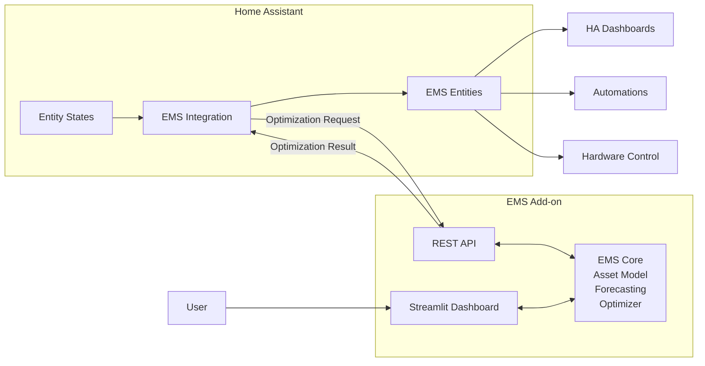
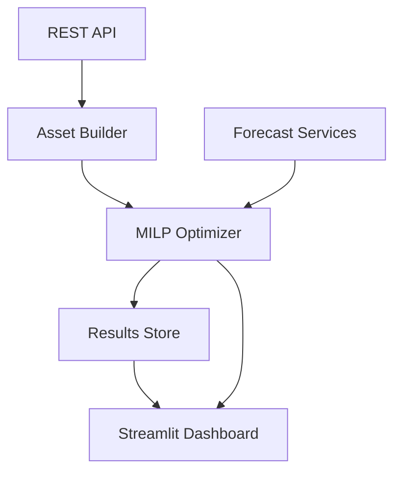
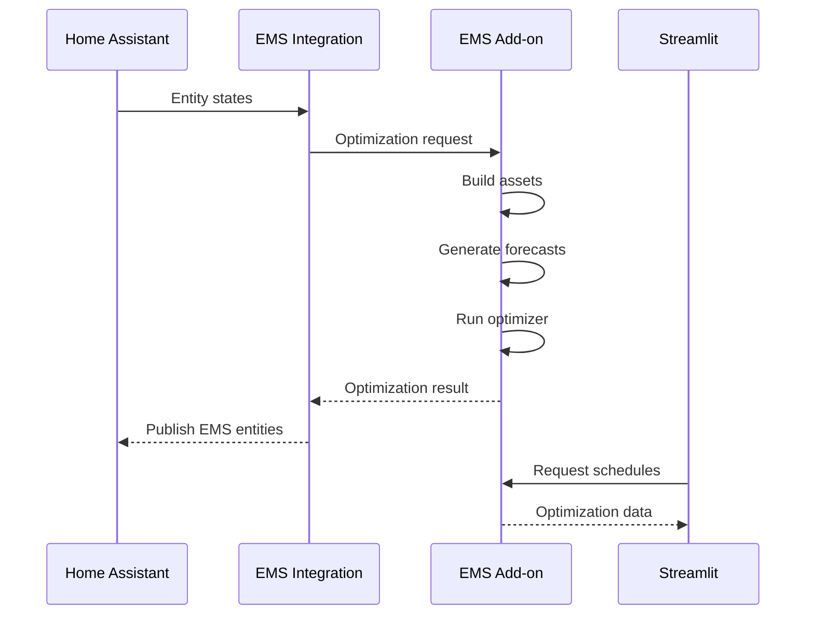
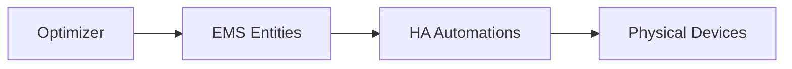

# Home Assistant EMS Architecture

## Overview

The EMS is split into two separate components:

1. **Home Assistant Integration**
2. **EMS Add-on**

This separation keeps the optimization engine independent from Home Assistant while still providing a native Home Assistant user experience.



---

# Design Goals

The architecture is designed to:

- Keep the optimizer independent from Home Assistant.
- Allow the optimizer to run as a standalone Docker application.
- Allow deployment outside Home Assistant.
- Minimize coupling to Home Assistant internals.
- Allow unrestricted use of Python packages and solver dependencies.
- Provide a native Home Assistant user experience.
- Keep visualization and optimization logic together.
- Allow Home Assistant to remain responsible for automation and hardware control.

---

# Components

## Home Assistant Integration

The integration acts as the bridge between Home Assistant and the EMS application.

### Responsibilities

- Read Home Assistant entity states.
- Allow users to select entities during configuration.
- Build optimization requests.
- Call the EMS Add-on API.
- Receive optimization results.
- Expose EMS results as Home Assistant entities.
- Provide Home Assistant device and entity registration.

### Example Inputs

```text
sensor.battery_soc
sensor.pv_power
sensor.pv_forecast
sensor.dynamic_energy_price
sensor.indoor_temperature
sensor.dhw_temperature
sensor.ev_soc
sensor.house_consumption
```

### Example Outputs

```text
sensor.ems_battery_power
sensor.ems_ev_power
sensor.ems_dhw_power
sensor.ems_building_power

sensor.ems_cost_forecast
sensor.ems_energy_cost_today

sensor.ems_status
sensor.ems_solver_state
```

---

## EMS Add-on

The EMS Add-on contains the actual EMS application and optimization engine.

### Responsibilities

- Asset creation.
- Forecast collection.
- Optimization.
- Schedule generation.
- Historical data storage.
- Visualization.

### Internal Components



---

# EMS Core

The EMS Core contains the reusable optimization engine.

It should have no dependencies on Home Assistant.

### Responsibilities

#### Asset Modelling

Examples:

```text
Grid
PV
Battery
EV
DHW Tank
Building Thermal Mass
```

#### Forecast Handling

Examples:

```text
Electricity prices
PV forecast
Consumption forecast
Weather forecast
```

#### Optimization

Input:

```text
Current Measurements
Forecasts
Constraints
```

Output:

```text
Optimal Power Schedules
```

#### Schedule Generation

Examples:

```text
Battery charging schedule
EV charging schedule
DHW heating schedule
Building pre-heating schedule
```

---

# Streamlit Dashboard

The Streamlit dashboard provides the engineering and configuration interface.

### Purpose

The dashboard is intended for:

- System configuration
- Schedule visualization
- Debugging
- Analysis

### Example Pages

#### Overview

```text
Current Optimization Status
Current Costs
Current Asset States
```

#### Forecasts

```text
Price Forecast
PV Forecast
Load Forecast
Weather Forecast
```

#### Asset States

```text
Battery SoC
EV SoC
DHW Temperature
Building Temperature
```

#### Schedules

```text
Battery Power Schedule
EV Charging Schedule
DHW Heating Schedule
Building Thermal Schedule
```

#### Cost Analysis

```text
Import Cost
Export Revenue
Thermal Storage Benefit
Total Predicted Cost
```

---

# API Interface

## Optimization Request

```http
POST /optimize
```

Example:

```json
{
  "battery_soc": 0.65,
  "battery_capacity": 13.5,
  "pv_power": 2.4,
  "price": 0.29,
  "indoor_temp": 20.5
}
```

---

## Optimization Response

```json
{
  "status": "success",
  "battery_power_kw": 3.5,
  "ev_power_kw": 0.0,
  "dhw_power_kw": 1.4,
  "building_power_kw": 1.1,
  "predicted_cost_eur": 2.31
}
```

---

# Data Flow



---

# Control Flow

The EMS does not directly control hardware.

Instead, it generates recommended setpoints.



Example:

```text
battery_power_kw = 3.5
```

becomes:

```text
sensor.ems_battery_power
```

A Home Assistant automation can then translate this into a battery-specific command.

---

# Deployment Architecture

## Development

```text
Docker Compose
 └─ EMS Container
```

## Home Assistant

```text
Home Assistant
├─ EMS Integration
└─ EMS Add-on
```

## Future Platforms

```text
Home Assistant
Docker Compose
Proxmox
OpenEMS
Node-RED
Cloud Services
```

All platforms can use the same EMS Core.

---

# Advantages

## Home Assistant Integration

Provides:

- Native entities.
- Config flows.
- Automations.
- Dashboard integration.
- Device management.

## EMS Add-on

Provides:

- Fully isolated Python environment.
- Independent dependency management.
- CBC, PuLP, OR-Tools support.
- Forecasting services.
- Streamlit dashboard.
- Independent release cycle.

## EMS Core

Provides:

- Reusable optimizer.
- Platform independence.
- Easier testing.
- Simpler maintenance.
- Reuse outside Home Assistant.

---

# Summary

The EMS consists of three logical layers:

```text
EMS Integration
    ↓
EMS Add-on
    ↓
EMS Core
```

Where:

- The **Integration** provides Home Assistant connectivity.
- The **Add-on** provides the application runtime, API, and Streamlit user interface.
- The **Core** provides forecasting, optimization, and scheduling logic.

This architecture keeps the optimizer independent, scalable, and reusable while still providing a first-class Home Assistant experience.