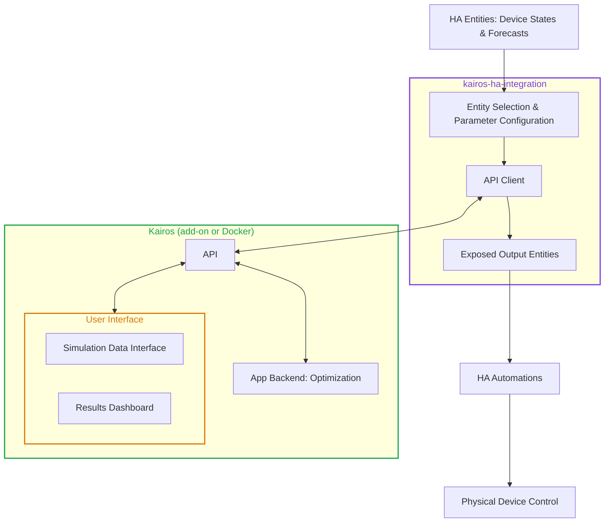

# Home Assistant Integration Architecture for Kairos
###  Easy, optimized energy scheduling for Home Assistant

> **Status:** draft. This document builds on `backend_architecture.md` (sign convention, asset classes, conversion layer, optimizer). It describes how Kairos connects to Home Assistant (HA); it does not repeat the optimizer design.

# Contents

- [System Overview](#system-overview)
  - [Goals and Non-Goals](#goals-and-non-goals)
  - [Components](#components)
  - [Control Cycle](#control-cycle)
- [App API](#app-api)

# System Overview

## Goals and Non-Goals

**Goals**

- Let a user select the HA entities that represent their energy system and describe their devices, with as little effort as possible.
- Compute an optimized plan (power setpoints per controllable asset over the planning horizon) with the Kairos optimizer.
- Expose that plan as HA entities.
- Provide a dashboard in the App that shows the latest optimization results and their history.

**Non-goals**

- Kairos does **not** send commands to physical devices. How a setpoint is applied is the responsibility of the user, through their own automations.
- The integration does not ship dashboards or cards. Entity selection relies on HA's native selectors, and result visualization is the job of the APP, while users can ofcourse build their own dashboard using the exposed entities of the integration via the `plan` attribute on entities.
- Kairos does not depend on any cloud service.

## Components

Kairos consists of two parts. The **App** (GitHub repository `Kairos`) is the Kairos application that holds all logic. It is delivered as a Home Assistant add-on or as a standalone Docker container. The **integration** (GitHub repository `Kairos-ha-integration`) is the HA custom component that connects Home Assistant to the App.

| | **App** (add-on or standalone Docker) | **Integration** (custom component, HACS) |
|---|---|---|
| Role | Core functionality and logic | Thin bridge between HA and the App |
| Contains | Normalization, forecast parsing, conversion layer, MILP optimizer, setpoint generation, results dashboard, simulation data user interface | Entity configuration, API call, output entity exposure |
| Knows about HA | Nothing (only entity IDs as opaque labels) | Everything HA-specific |
| Knows about devices | All asset types and their parameters | Nothing, only "entity in, entity out" |

The App image also contains a Streamlit **dashboard** with two parts: the **results dashboard**, which shows the latest optimization results, and the **simulation interface**, where scenario data can be entered to run the optimizer on non-real data. This lets users try Kairos and lets developers test the optimizer without Home Assistant or the integration. The dashboard runs as a second process next to the API and talks to it only through the API.

## Control Cycle

Each cycle (default every 15 minutes):

1. The integration reads all entities and forecast attributes.
2. It sends them **unmodified** (plus per-entity hints such as unit and sign) to `POST /optimize`.
3. The App normalizes the data, runs the conversion layer, solves the MILP, stores the full optimization record (inputs to API and outputs), and returns the optimization results.
4. The integration updates the corresponding Home Assistant entities. Each setpoint entity exposes the value for the current optimization timestep as its state, while the complete optimization schedule is available through a plan attribute. As time advances, the entity state automatically moves to the next scheduled timestep without requiring a new optimization run.
5. The user's automations react to the setpoint entities and control the devices.
6. The next cycle observes the new states of the entities and forecasts. Because optimization is repeated continuously in a receding-horizon fashion, Kairos does not need confirmation that a previous setpoint was executed successfully. The measured state inherently reflects the effect of all previously applied control actions, and any deviation from the plan is corrected during the next optimization run

# App API
