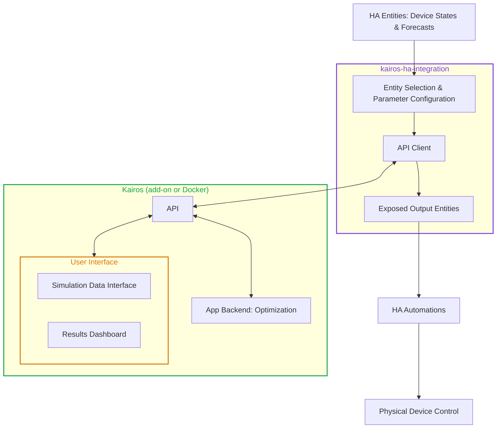

# Home Assistant Integration Architecture for Kairos
###  Easy, optimized energy scheduling for Home Assistant

> **Status:** final. This document builds on `backend_architecture.md` (sign convention, asset classes, conversion layer, optimizer) and `kairos/openapi.yaml` (API contract). It describes how Kairos connects to Home Assistant (HA); it does not repeat the optimizer design.

# Contents

- [System Overview](#system-overview)
  - [Goals and Non-Goals](#goals-and-non-goals)
  - [Components](#components)
  - [Control Cycle](#control-cycle)
- [App API](#app-api)
  - [Endpoints](#endpoints)
  - [Request](#request)
  - [Response](#response)
- [End-to-End Workflow](#end-to-end-workflow)
  - [Configuration](#configuration)
  - [Data Collection](#data-collection)
  - [API Request](#api-request)
  - [Optimization](#optimization)
  - [Optimization Response](#optimization-response)
  - [Entity Updates](#entity-updates)
  - [Device Control](#device-control)
- [Failure Handling](#failure-handling)

# System Overview

## Goals and Non-Goals

**Goals**

- Let a user select the HA entities that represent their energy system and describe their devices, with as little effort as possible.
- Compute an optimized schedule (power setpoints per controllable asset over the planning horizon) with the Kairos optimizer.
- Expose that schedule as HA entities.
- Provide a dashboard in the App that shows the latest optimization results and their history.

**Non-goals**

- Kairos does **not** send commands to physical devices. How a setpoint is applied is the responsibility of the user, through their own automations.
- The integration does not ship dashboards or cards. Entity selection relies on HA's native selectors, and result visualization is the job of the App. Users can of course build their own dashboards from the entities exposed by the integration, using the `schedule` attribute.
- Kairos does not depend on any cloud service.

## Components

Kairos consists of two parts. The **App** (GitHub repository `Kairos`) is the Kairos application that holds all logic. It is delivered as a Home Assistant add-on or as a standalone Docker container. The **integration** (GitHub repository `Kairos-ha-integration`) is the HA custom component that connects Home Assistant to the App.

| | **App** (add-on or standalone Docker) | **Integration** (custom component, HACS) |
|---|---|---|
| Role | Core functionality and logic | Thin bridge between HA and the App |
| Contains | Cconversion layer, MILP optimizer, setpoint generation, results dashboard, simulation data user interface | Entity configuration, API call, output entity exposure |
| Knows about HA | Nothing (only entity IDs as opaque labels) | Everything HA-specific |
| Knows about devices | All asset types and their parameters | Nothing, only "entity in, entity out" |

The App image also contains a Streamlit **dashboard** with two parts: the **results dashboard**, which shows the latest optimization results, and the **simulation interface**, where scenario data can be entered to run the optimizer on non-real data. This lets users try Kairos and lets developers test the optimizer without Home Assistant or the integration. The dashboard runs as a second process next to the API and talks to it only through the API.



## Control Cycle

Each cycle (default every 15 minutes):

1. **Data collection**: The integration reads all entities and forecast attributes.
2. **API request**: It sends them **unmodified** (plus per-entity hints such as unit and sign) to `POST /optimize`.
3. **Optimization**: The App runs the conversion layer, solves the MILP, stores the full optimization record (inputs to API and outputs), and returns the optimization results.
4. **Entity update**: The integration updates the corresponding Home Assistant entities. Each setpoint entity exposes the value for the current optimization timestep as its state, while the complete optimization schedule is available through a `schedule` attribute. As time advances, the entity state automatically moves to the next scheduled timestep without requiring a new optimization run.
5. **Device control**: The user's automations react to the setpoint entities and control the devices.

The next cycle observes the new states of the entities and forecasts. Because optimization is repeated continuously in a receding-horizon fashion, Kairos does not need confirmation that a previous setpoint was executed successfully. The measured state inherently reflects the effect of all previously applied control actions, and any deviation from the schedule is corrected during the next optimization run.

Each step is described in detail in [End-to-End Workflow](#end-to-end-workflow).


# App API

The API is the only contract between the integration and the App. Everything the integration sends or receives is defined here; the optimizer internals stay behind it.

## Endpoints

| Endpoint | Used by | Purpose |
|---|---|---|
| `POST /optimize` | Integration, simulation interface | Run an optimization from device-specific physical parameters. The App applies the conversion layer. **This is the endpoint the integration uses.** |
| `POST /optimize-generic` | Simulation interface, developers | Run an optimization from the generic storage model, skipping the physical storage conversion layer. |
| `GET /health` | Integration, simulation interface | Check the health status of the App. |

The integration uses `POST /optimize` rather than `/optimize-generic` because it passes device-specific storage parameters through, and the conversion layer stays in the App, the only place that knows how to convert them.

## Request

The `POST /optimize` request follows `OptimizationRequest` in `kairos/openapi.yaml`: it contains `timestamp`, `time_step_duration_hours`, `horizon_hours`, `grid`, optional `pv`, `base_load`, optional `controllable_loads`, and `storage`. Each storage item uses physical parameters for `HomeBattery`, `EVBattery`, `DHWTank` or `BuildingThermalMass`, discriminated by `storage_type`. Asset `id` values are opaque labels to the App, and the integration uses them to map the response back to entities. `/optimize-generic` uses the same top-level fields with generic storage parameters.

## Response

The response follows `OptimizationResponse`: `status`, `objective_cost`, `time_step_minutes`, and `assets` keyed by asset ID. Each asset contains a `setpoint`, `unit`, and timestamped `schedule` of `{time, value}` points; storage assets also contain `soc_schedule`, with one end-of-interval point per time step (the current SoC is not included). Power values follow the backend sign convention. The optimizer returns schedules for the grid, storage, and active controllable loads; PV and base load are inputs, not scheduled assets.

# End-to-End Workflow
## Configuration

Configuration happens once, in the integration's config flow, and is designed so that selecting entities takes most of the effort. The integration stores each asset as a **config subentry**, so assets can be added, edited or removed later without redoing the setup.

**Step 1: Connect to the App.** For the add-on, the App is discovered automatically through the Supervisor. For a standalone Docker container, the user enters host and port. The flow calls `GET /health` to verify the connection.

**Step 2: Global settings.** Sensible defaults are pre-filled, and most users keep them.

| Setting | Default | Notes |
|---|---|---|
| Update interval | 15 min | Cycles are aligned to the time-step grid, with a short offset so entities have refreshed. |
| Time step | 15 min (`0.25` h) | Matches `time_step_duration_hours`. |
| Horizon | 24 h | Sent as `horizon_hours`. |
| Request timeout | 60 s | Must be shorter than the update interval. |
| Failed cycles before a repair issue | 3 | See [Failure Handling](#failure-handling). |

**Step 3: Add assets.** The user adds one asset at a time, choosing the asset type. A grid connection is required; all other assets are optional. Each form combines HA selectors for dynamic values with plain inputs for static parameters.

| Asset | From HA entities (dynamic) | Entered once (static) |
|---|---|---|
| **Grid** | Current power; import price (+ forecast attribute, required); export price (+ forecast attribute, required) | Max import power, max export power |
| **PV** | Current power; forecast attribute (required) | none |
| **Base load** | Current power; forecast attribute (required) | none |
| **Controllable load** | Current power (optional) | Average power, energy demand, earliest start, latest finish (each a constant or bound to a helper entity) |
| **Home battery** | State of charge | Capacity, min/max SoC, max charge/discharge power, efficiencies, passive discharge |
| **EV battery** | State of charge | As home battery, plus vehicle efficiency, round trip distance, departure and arrival time (fixed daily time or a datetime entity) |
| **DHW tank** | Current water temperature | Volume, min/max/comfort temperature, heat loss coefficient, heat pump power and COP, morning/evening peak demand and time |
| **Building thermal mass** | Current indoor temperature | Floor area, thermal mass coefficient, weather compensation temperature, max comfort temperature, heating/cooldown rate, COP for +dT and default mode |

Details of the selectors:

- **Forecasts** use HA's `attribute` selector on the chosen entity, because forecast formats differ between integrations and live in entity attributes. If no forecast attribute is selected, the App holds the current value constant over the horizon. This is the intended behavior for fixed tariffs and is the baseline for a base load without a forecast. PV is the exception: it requires a forecast.
- **Unit hints** are read automatically from each entity's `unit_of_measurement`. The user is never asked for units.
- **Sign hint.** Grid power is the only entity with an ambiguous sign, so the flow asks once: "Positive means import" or "Positive means export".
- **Validation.** The flow checks that each entity exists, that its unit matches the expected dimension (power, energy, percentage, temperature, price per energy), and that the forecast attribute is present and non-empty.
- **Base load.** The selected entity represents the household's electrical consumption excluding every device modelled elsewhere in Kairos (battery and EV charging, DHW and building heat pumps, controllable loads). This is the residual household demand derived from historical data with modelled devices already excluded. 
- **Asset IDs.** Each subentry has a stable `id` (derived from its name at creation). It never changes afterwards, so history in the dashboard and the exposed entities stay consistent.

A manual trigger is available as the action `kairos.run_optimization`, for testing or for running after a change of settings.

## Data Collection

At the start of each cycle the integration reads, in a single pass so the snapshot is consistent:

- The state of every configured entity.
- The configured forecast attribute of every entity that has one.
- The static parameters and constants from the config entry.

If a **required** entity is `unavailable` or `unknown`, the cycle is skipped and no partial request is sent. A missing **optional** forecast is omitted from the request, and the App falls back to holding the current value constant.

## API Request

The integration builds one `POST /optimize` request from the snapshot. Shown below; arrays are truncated.

```json
{
  "timestamp": "2026-09-30T14:00:05+02:00",
  "time_step_duration_hours": 0.25,
  "horizon_hours": 24,
  "sources": [
    {
      "id": "grid_1",
      "name": "Main Grid Connection",
      "current_power": 1200,
      "max_import_power": 11000,
      "max_export_power": 11000,
      "power_forecast": [
        0
      ],
      "import_price_forecast": [
        0
      ],
      "export_price_forecast": [
        0
      ]
    }
  ],
  "loads": [
    {
      "id": "base_load_household",
      "name": "Household Base Load",
      "current_power": 450,
      "controllable": false,
      "average_power": 0,
      "energy_demand": 0,
      "earliest_start_time": "2026-09-30T18:00:51.869Z",
      "latest_finish_time": "2026-09-30T18:00:51.869Z",
      "power_forecast": [
        0
      ]
    }
  ],
  "storage": [
    {
      "id": "home_battery",
      "name": "Home Battery",
      "storage_type": "home_battery",
      "current_soc": 0.5,
      "energy_capacity": 10000,
      "min_soc": 0.1,
      "max_soc": 0.9,
      "max_charge_power": 5000,
      "max_discharge_power": 5000,
      "charge_efficiency": 0.95,
      "discharge_efficiency": 0.95,
      "passive_discharge_power": 0
    },
    {
      "id": "ev_battery",
      "name": "EV Battery",
      "storage_type": "ev_battery",
      "current_soc": 0.5,
      "energy_capacity": 60000,
      "min_soc": 0.1,
      "max_soc": 0.9,
      "max_charge_power": 7400,
      "max_discharge_power": 0,
      "charge_efficiency": 0.95,
      "discharge_efficiency": 0.95,
      "passive_discharge_power": 0,
      "vehicle_efficiency": 0.005,
      "round_trip_distance": 100,
      "expected_departure_time": "2024-01-01T09:00:00Z",
      "expected_arrival_time": "2024-01-01T18:00:00Z"
    },
    {
      "id": "dhw_tank",
      "name": "DHW Tank",
      "storage_type": "dhw_tank",
      "tank_volume": 300,
      "min_water_temperature": 20,
      "max_water_temperature": 60,
      "current_water_temperature": 50,
      "min_comfort_temperature": 40,
      "heat_loss_coefficient": 4,
      "heat_pump_electric_power": 3000,
      "heat_pump_cop": 3,
      "morning_peak_demand": 150,
      "evening_peak_demand": 180,
      "morning_peak_time": "07:00",
      "evening_peak_time": "19:00"
    },
    {
      "id": "building_thermal_mass",
      "name": "Building Thermal Mass",
      "storage_type": "building_thermal_mass",
      "floor_area": 100,
      "thermal_mass_coefficient": 200,
      "default_weather_compensation_temperature": 20,
      "current_indoor_temperature": 20.5,
      "max_comfort_temperature": 21,
      "heating_rate": 0.6,
      "cooldown_rate": 0.1,
      "heat_pump_cop_charge": 2.5,
      "heat_pump_cop_default": 3
    }
  ]
}
```

## Optimization

This step runs entirely in the App. The integration only waits for the response, and the details of the solver are in `backend_architecture.md`.

1. **Validate** the request. Invalid payloads return `400`.
2. **Parse forecasts**: align raw forecast data to the time grid that starts at `timestamp` (floored to the time-step boundary) and spans `horizon_hours`. Entities without a forecast are held constant at the current value.
3. **Convert** each storage asset with the conversion layer into the unified storage model.
4. **Solve** the MILP with CBC/PuLP.
5. **Store** the full optimization record: the request as received, the unified inputs, the response, solver status and duration.
6. **Respond** with the schedule.

## Optimization Response

The integration reads `status` first:

| Status | Integration behavior |
|---|---|
| `Optimal` | Apply the schedule. |
| `Feasible` | Apply the schedule (valid but not proven optimal, e.g. solver time limit reached). The status is visible on the diagnostic sensor. |
| `Infeasible` | Do not apply. Keep following the previous schedule and count the cycle as failed. |

For an applied schedule, `assets[asset_id].schedule[k].value` is the setpoint in W for the interval starting at `assets[asset_id].schedule[k].time`. The response also provides the immediate `setpoint`, `unit`, and `time_step_minutes`; storage assets include an end-of-interval `soc_schedule` with one point per time step (excluding the current SoC). The integration stores the schedule in memory and persists it with HA's storage helper, so a restart does not lose it.

## Entity Updates

Every controllable asset in the schedule gets a **setpoint sensor**. The integration creates one HA device per configured asset, plus one Kairos device for system-level entities.

| Entity | State | Attributes |
|---|---|---|
| `sensor.kairos_<asset>_setpoint` | Setpoint for the current time step [W], following the backend sign convention (storage: + charge, − discharge; loads ≥ 0) | `schedule`, `time_step_minutes`, `optimization_id`, `optimized_at` |
| `sensor.kairos_<asset>_mode` (building thermal mass only) | `charge` (+dT), `neutral` (0), `discharge` (−dT) | same as above |
| `sensor.kairos_status` (diagnostic) | `optimal`, `feasible`, `infeasible`, `error` | `last_run`, `duration`, `consecutive_failures` |
| `sensor.kairos_objective_cost` (diagnostic) | Objective cost of the latest optimization | `optimization_id` |

The `schedule` attribute is a list of `{ "time": <ISO 8601 timestamp>, "value": <W> }` entries covering the whole horizon, so a user can chart or template against it.

The building thermal mass is controlled through a heat pump temperature offset rather than a power level. Its setpoint sensor still carries the planned power in W, but the **mode** sensor is the one automations should use: a positive value maps to `charge`, a negative value to `discharge`, and zero to `neutral`.

**Advancing through the schedule.** The integration runs a step clock aligned to the time-step grid. At each boundary it sets the state of every setpoint entity to the next scheduled value, without calling the App. A new optimization replaces the stored schedule whenever one completes. If the schedule runs out (the App has been unreachable for the whole horizon), the setpoint entities become `unavailable`, so automations never act on an expired schedule.

## Device Control

Applying setpoints is entirely the user's responsibility. The integration only guarantees that the setpoint entities have a meaningful state or are `unavailable`. A typical automation reacts to the entity and translates the setpoint into whatever the device accepts. The entity IDs below are placeholders for the user's own battery integration.

```yaml
alias: Kairos - apply home battery setpoint
triggers:
  - trigger: state
    entity_id: sensor.kairos_home_battery_setpoint
conditions:
  - condition: template
    value_template: "{{ is_number(trigger.to_state.state) }}"
actions:
  - choose:
      - conditions: "{{ trigger.to_state.state | float > 0 }}"
        sequence:
          - action: select.select_option
            target: { entity_id: select.battery_mode }
            data: { option: "charge" }
          - action: number.set_value
            target: { entity_id: number.battery_charge_power }
            data: { value: "{{ trigger.to_state.state | float }}" }
      - conditions: "{{ trigger.to_state.state | float < 0 }}"
        sequence:
          - action: select.select_option
            target: { entity_id: select.battery_mode }
            data: { option: "discharge" }
          - action: number.set_value
            target: { entity_id: number.battery_discharge_power }
            data: { value: "{{ trigger.to_state.state | float | abs }}" }
    default:
      - action: select.select_option
        target: { entity_id: select.battery_mode }
        data: { option: "idle" }
```

Good practice for these automations:

- Ignore `unavailable` and `unknown` states (as in the condition above), or define a safe fallback mode for the device.
- Devices that revert on their own (inverter timeouts, charger watchdogs) benefit from re-sending the setpoint periodically, for example with an additional time-pattern trigger.
- Kairos does not need to know whether a setpoint was applied. The next cycle reads the resulting device states and corrects any deviation.


# Failure Handling

The guiding principle is that a failed cycle never produces a bad setpoint. The integration keeps following the last valid schedule until it expires, and surfaces the problem instead of hiding it.

| Situation | Integration behavior |
|---|---|
| App unreachable or request timeout | Skip the cycle, keep following the current schedule, retry next cycle. Raise an HA repair issue after the configured number of consecutive failures. |
| `400` from the API | Do not retry the same payload. Log the error detail from the response, raise a repair issue pointing at the configuration, keep the current schedule. |
| `Infeasible` status | Keep the current schedule, count the cycle as failed. |
| Required entity `unavailable` or `unknown` | Skip the cycle without sending partial data. The repair issue names the entity. |
| Optional forecast missing | Send the request without it. The App holds the current value constant. |
| Schedule exhausted | Setpoint entities become `unavailable`. |
| HA restart | Restore the persisted schedule, resume the step clock, and run a cycle immediately. |
| App restart | No action needed. Each request is self-contained, and stored records persist on the App's data volume. |

Repair issues clear themselves as soon as a cycle succeeds.